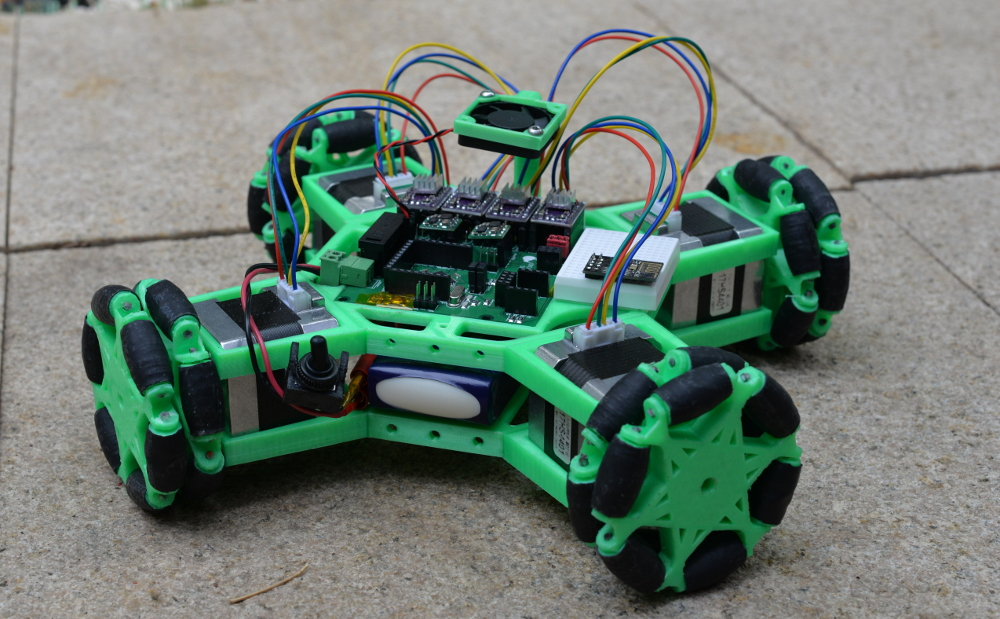
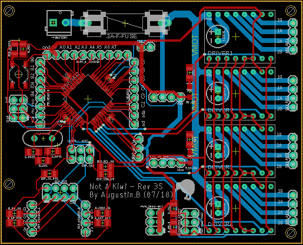
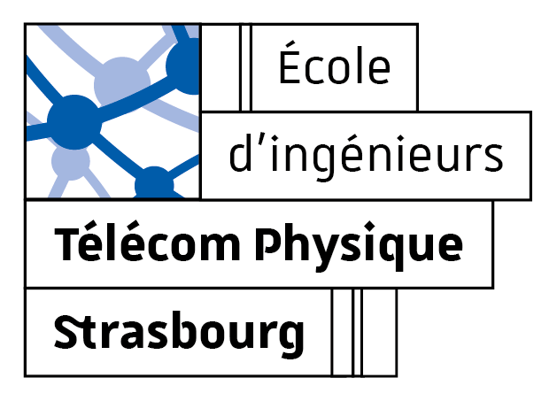

# Not_A_Kiwi

Not A Kiwi is an Open-Source, fully 3D printed holonomic robot controlled by a custom PCB. Its aims are to be an educational platform for engineering students and an entry in the 2019 Coupe de France de Robotique for the Robotics Assocations of Télécom Physique Strasbourg.

This robot is meant for anyone seeking to have a fun and looking for an open robotics plateform to learn and expand on. The only tool needed to build one is a 3D printer, as the PCB can be bought online or provided by me (soldered or not).

## Features
- Based on a standard ATMega32, easily programmable with any ISP programmer.
- Many headers and an integrated breadboard to test out new ideas and add sensors.
- Very easy to print, no complex parts.
- Modular 3D printed structure makes it easy to add any kind of sensor or effector.
- ESP01 socket (UART or I2C communication with the AVR) for IoT applications.

## Hardware
The hardware is the most developped part of this project as the code is still being written.

### BOM
- 4 Nema17 stepper motors (38mm)
- 4 DRV8825 stepper motor driver carriers (or A4988-Pinout-Compatible)
- 5V Pololu Regulator (D24V5F5, but I intend to replace them with a simpler/cheaper solution)
- 3.3V Pololu regulator (D24V5F3)
- ESP01 (not required)
- 12V LiPo battery (but any 12V to 36V battery will work fine)
- Not A Kiwi Board (Detailed below)
- Small Breadboard
- 30mm 0.15A fan
- 3D printed structure

#### Not A Kiwi Board

The board is a simple Atmega32 based board that includes 4 stepper motor driver carriers sockets as well as support for an ESP01 chip, communicating over either UART or I2C depending on a choice of jumpers. The BOM is rather small, as the board is meant to be programmed through ICSP. It is easily possible to send the BOM and Gerber files to a PCB production service to obtain one, although I can also provide fully soldered and tested ones for a fee (Europe only).

#### PCB BOM
The board uses a majority of SMD components, all 1206 except the AVR smoothing capacitor and a zener diode to adapt the 5V logic of the avr to the 3.3V of the ESP01.

Most of these components can be soldered by hand, although it is advised to use solder paste and a reflow oven (a simple and inexpensive toaster oven is enough for this purpose).

Full BOM files are provided in the repository, in a format compatible with most PCB manufacturers. 
An article explaining the choices behind the parts, and possible alternatives will be available on the wiki.

#### 3D printed structure

  The robot uses a simple 3D printed structure composed of 12 parts, it takes approximately 12 hours to print, not counting in the 3D printed omniwheels, but it would be much better to use bought ones, albeit more expensive (3D printed wheels have a negligeable cost, but perform more poorly, several design will be tested and offered here).
  
  The CAD files provided are Fusion 360 parametric files and therefore should also be compatible with Autodesk Inventor and SolidWorks (tested). If you just wish to print the robot, .STL files are also provided. The Kit also uses M3 screws and nuts, it is very quick and easy to assemble (less than an hour).
  
  

